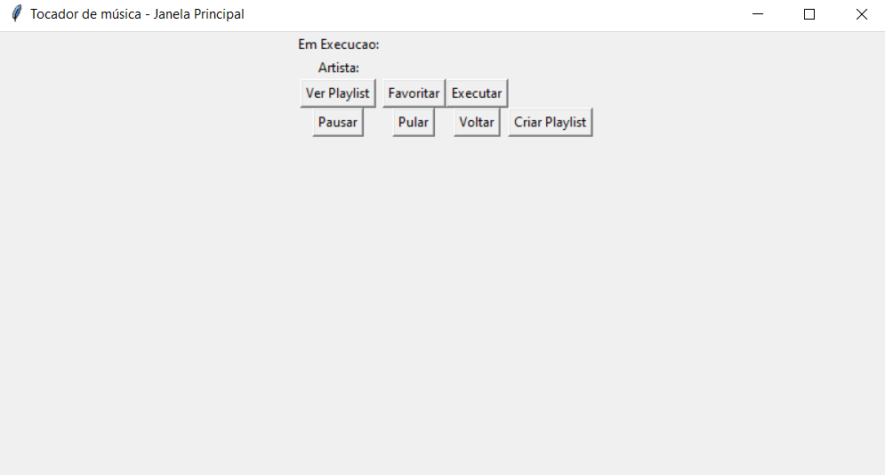
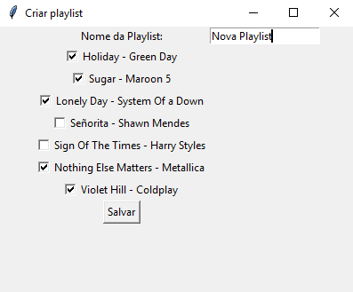

# Player de Música

Ferramenta para ouvir músicas

## Como usar

### Abrir a ferramenta

Primeiro vá até o terminal e navegue até o diretório aonde está os arquivos

digite o seguinte comando para estabelecer o servidor

depois o seguinte comando para estabelecer o cliente (que é declarado na main)

### Fazer cadastro

Para cadastrar um novo usuário, clicar no botão cadastrar

Digitar os dados nos campos e clicar no botão Terminar

### Fazer login

Digitar o usuário e a senha nos campos da janela e clicar em Entrar

### Janela principal

A janela principal contem dados sobre a musica em execução, artista, e outras funcionalidades como : criar playlist, ver playlist, parar musica, executar musica, pular musica, voltar música e favoritar uma música.

### Criar playlist

Para criar uma playlist adicione o nome na box e selecione as musicas desejadas, ao final clicar no botão Salvar. Obs: Esta funcionalidade não está funcionando corretamente devido a algum bug na comunicação para o servidor, a janela para de responder.

### Abrir playlist

Ao clicar no botão Ver Playlist, a janela com as playlists apareceriam, porém a função de criação de playlist está com bugs.

<h1>Desenvolvedores:</h1>
 
 <table>
  <tbody><tr> <td align="center">
      <a href="https://github.com/igorcbrito">
        
         
        <b>Igor Brito</b>
      </a> 
        <b>Thatiana Ribeiro</b>
      </a> 
    </td>
  </tr>
</tbody></table>

