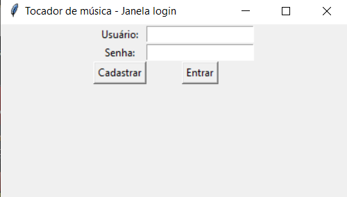

# Player de Música

Ferramenta para ouvir músicas

## Como usar

### Abrir a ferramenta

Primeiro vá até o terminal e navegue até o diretório aonde está os arquivos

digite o seguinte comando para estabelecer o servidor

depois o seguinte comando para estabelecer o cliente (que é declarado na main)

### Fazer cadastro

Para cadastrar um novo usuário, clicar no botão cadastrar

Digitar os dados nos campos e clicar no botão Terminar

### Fazer login

Digitar o usuário e a senha nos campos da janela e clicar em Entrar

### Janela principal

A janela principal contem dados sobre a musica em execução, artista, e outras funcionalidades como : criar playlist, ver playlist, parar musica, executar musica, pular musica, voltar música e favoritar uma música.

### Criar playlist

### Abrir playlist

Ao clicar no botão Ver Playlist, a janela com as playlists apareceriam, porém a função de criação de playlist está com bugs.

